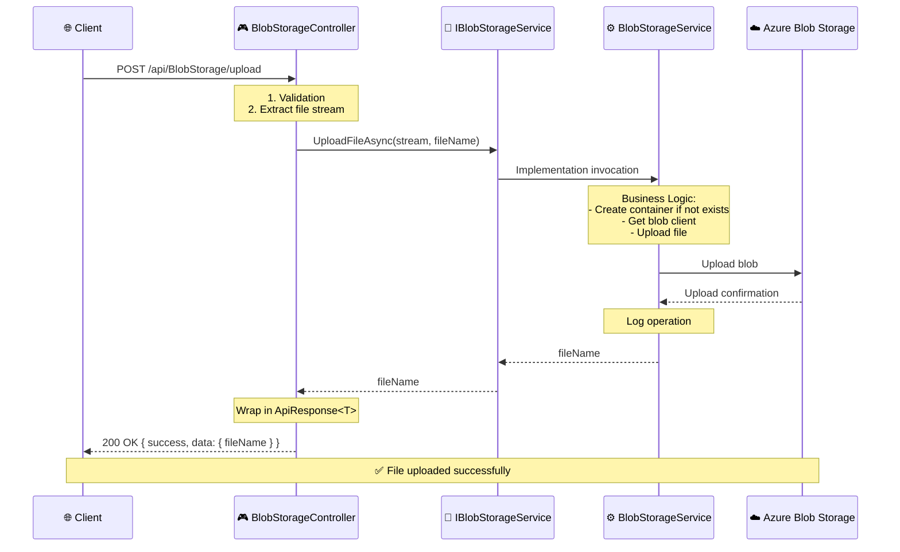
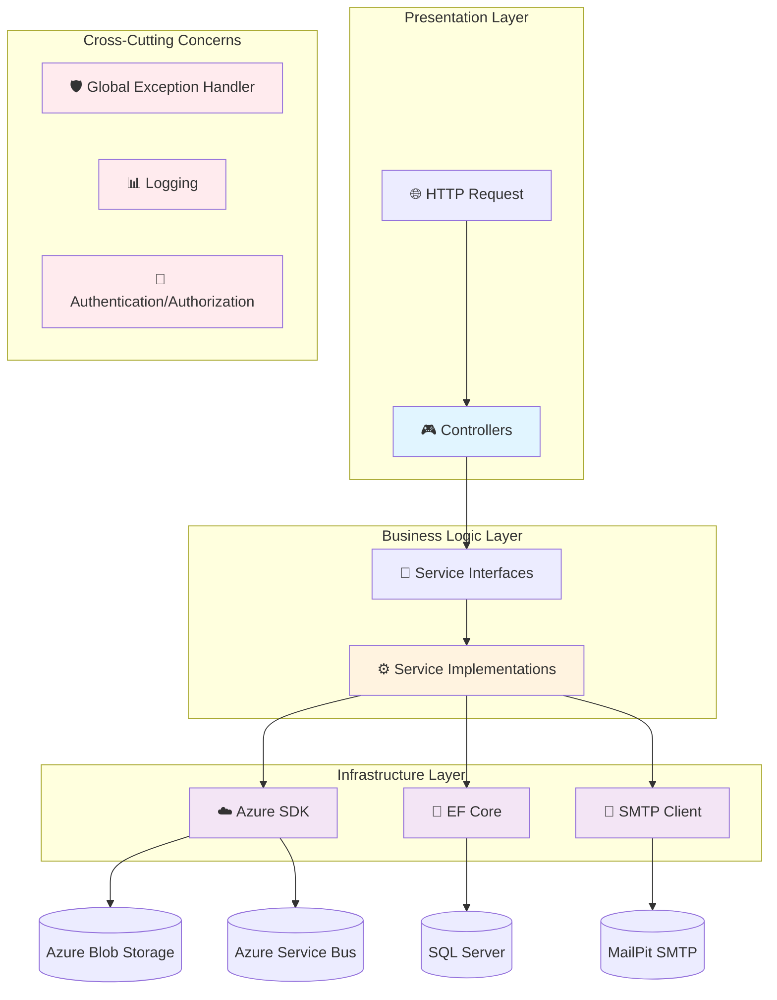
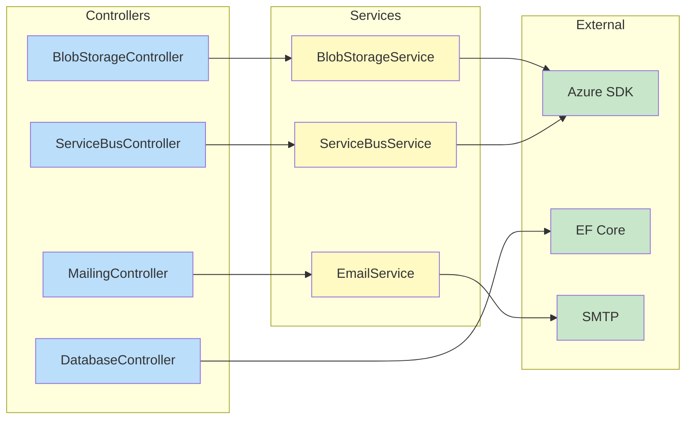
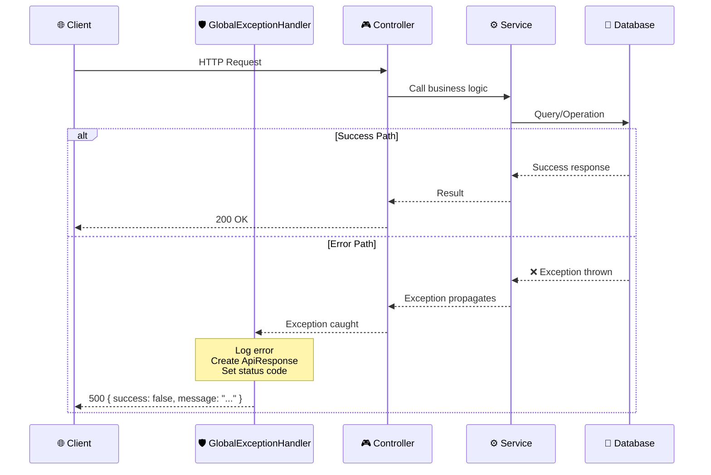
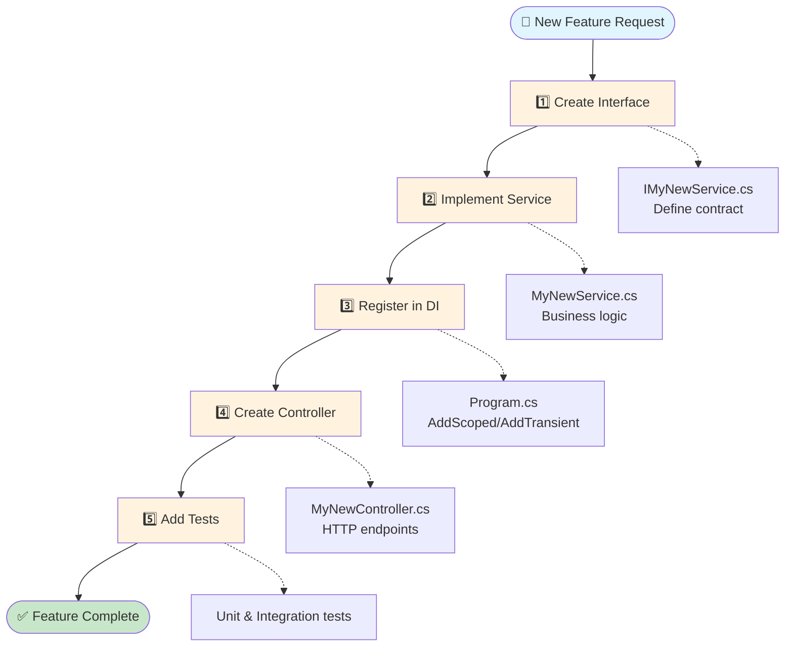

# 🏗️ APPLICATION ARCHITECTURE - QUICK REFERENCE

## 📁 Project Structure

```
NetChapterAspire.Server/
│
├── Controllers/                    # HTTP Layer
│   ├── BlobStorageController.cs   # File upload/download handling
│   ├── DatabaseController.cs      # Book CRUD operations
│   ├── MailingController.cs       # Email sending
│   └── ServiceBusController.cs    # Messaging
│
├── Services/                       # Business Logic Layer
│   ├── Interfaces/
│   │   ├── IBlobStorageService.cs
│   │   ├── IEmailService.cs
│   │   └── IServiceBusService.cs
│   │
│   ├── BlobStorageService.cs      # Azure Blob Storage logic
│   ├── EmailService.cs            # Email sending logic
│   └── ServiceBusService.cs       # Azure Service Bus logic
│
├── Models/
│   ├── Common/
│   │   └── ApiResponse.cs         # Common response model
│   ├── DTOs/
│   │   ├── AddBookRequest.cs
│   │   ├── SendMailRequest.cs
│   │   └── SendMessageRequest.cs
│   └── Book.cs                    # Entity
│
├── Data/
│   └── ApplicationDbContext.cs    # EF Core DbContext
│
├── Middleware/
│   └── GlobalExceptionHandler.cs  # Centralized error handling
│
└── Program.cs                      # Configuration and startup
```

### Project Structure Visualization

```mermaid
graph TD
    Root[NetChapterAspire.Server]
    
    Root --> Controllers[📁 Controllers]
    Root --> Services[📁 Services]
    Root --> Models[📁 Models]
    Root --> Data[📁 Data]
    Root --> Middleware[📁 Middleware]
    Root --> Program[📄 Program.cs]
    
    Controllers --> BlobCtrl[🎮 BlobStorageController]
    Controllers --> DbCtrl[🎮 DatabaseController]
    Controllers --> MailCtrl[🎮 MailingController]
    Controllers --> SbCtrl[🎮 ServiceBusController]
    
    Services --> SvcInt[📁 Interfaces]
    Services --> BlobSvc[⚙️ BlobStorageService]
    Services --> EmailSvc[⚙️ EmailService]
    Services --> SbSvc[⚙️ ServiceBusService]
    
    SvcInt --> IBlobSvc[🔌 IBlobStorageService]
    SvcInt --> IEmailSvc[🔌 IEmailService]
    SvcInt --> ISbSvc[🔌 IServiceBusService]
    
    Models --> Common[📁 Common]
    Models --> DTOs[📁 DTOs]
    Models --> BookEntity[📦 Book]
    
    Common --> ApiResp[📋 ApiResponse]
    DTOs --> AddBook[📝 AddBookRequest]
    DTOs --> SendMail[📝 SendMailRequest]
    DTOs --> SendMsg[📝 SendMessageRequest]
    
    Data --> DbContext[💾 ApplicationDbContext]
    Middleware --> ExHandler[🛡️ GlobalExceptionHandler]
    
    style Controllers fill:#e1f5ff
    style Services fill:#fff3e0
    style Models fill:#f3e5f5
    style Data fill:#c8e6c9
    style Middleware fill:#ffebee
    style Program fill:#fff9c4
```



---

## 🔄 REQUEST FLOW

### Example: File Upload to Blob Storage



### Flow Description

1. **HTTP Request** - Client sends POST request with file
2. **Controller Layer** - Validates input and extracts file stream
3. **Service Interface** - Defines contract for business logic
4. **Service Implementation** - Executes business logic and calls Azure SDK
5. **Infrastructure** - Azure Blob Storage stores the file
6. **Response Flow** - Returns through layers with `ApiResponse<T>`
7. **HTTP Response** - Client receives JSON response

---

## 🏗️ ARCHITECTURE OVERVIEW

### Layered Architecture Diagram



### Component Dependencies



---

## 🎯 LAYER RESPONSIBILITIES

### Controllers (HTTP Layer)
**Responsibilities:**
- Receiving HTTP requests
- Input validation
- Invoking appropriate service
- Returning HTTP responses

**SHOULD NOT:**
- ❌ Contain business logic
- ❌ Directly invoke Azure SDK
- ❌ Handle exceptions (GlobalExceptionHandler does this)
- ❌ Create complex objects

**Example:**
```csharp
[HttpPost("upload")]
public async Task<IActionResult> UploadFile(IFormFile? file)
{
    if (file is not { Length: not 0 })
        return BadRequest(ApiResponse.ErrorResponse("No file provided"));

    await using var stream = file.OpenReadStream();
    var fileName = await _blobStorageService.UploadFileAsync(stream, file.FileName);

    return Ok(ApiResponse<object>.SuccessResponse(
        new { fileName, message = "File uploaded successfully" }
    ));
}
```

---

### Services (Business Logic Layer)
**Responsibilities:**
- Business logic
- Operation orchestration
- Calling infrastructure (Azure SDK, DB)
- Operation logging

**SHOULD NOT:**
- ❌ Know about HTTP (Request, Response)
- ❌ Create ActionResults
- ❌ Handle routing

**Example:**
```csharp
public class BlobStorageService : IBlobStorageService
{
    public async Task<string> UploadFileAsync(Stream fileStream, string fileName)
    {
        var containerClient = _blobServiceClient.GetBlobContainerClient(ContainerName);
        await containerClient.CreateIfNotExistsAsync();

        var blobClient = containerClient.GetBlobClient(fileName);
        await blobClient.UploadAsync(fileStream, overwrite: true);

        _logger.LogInformation("File uploaded: {FileName}", fileName);
        return fileName;
    }
}
```

---

### Middleware (Cross-cutting concerns)
**Responsibilities:**
- Global error handling
- Request logging
- Authentication/Authorization (future)

**Example:**
```csharp
public class GlobalExceptionHandler : IExceptionHandler
{
    public async ValueTask<bool> TryHandleAsync(
        HttpContext httpContext,
        Exception exception,
        CancellationToken cancellationToken)
    {
        _logger.LogError(exception, "Unhandled exception");
        
        var response = ApiResponse.ErrorResponse("An error occurred");
        await httpContext.Response.WriteAsJsonAsync(response);
        
        return true;
    }
}
```

### Error Handling Flow



---

## 🧪 HOW TO TEST

### 1. **Service Unit Tests**
```csharp
public class BlobStorageServiceTests
{
    [Fact]
    public async Task UploadFileAsync_ValidStream_ReturnsFileName()
    {
        // Arrange
        var mockBlobServiceClient = new Mock<BlobServiceClient>();
        var mockLogger = new Mock<ILogger<BlobStorageService>>();
        var service = new BlobStorageService(mockBlobServiceClient.Object, mockLogger.Object);
        
        // Act
        var result = await service.UploadFileAsync(stream, "test.txt");
        
        // Assert
        Assert.Equal("test.txt", result);
    }
}
```

### 2. **Controller Integration Tests**
```csharp
public class BlobStorageControllerTests
{
    [Fact]
    public async Task UploadFile_ValidFile_ReturnsSuccess()
    {
        // Arrange
        var mockService = new Mock<IBlobStorageService>();
        mockService.Setup(x => x.UploadFileAsync(It.IsAny<Stream>(), It.IsAny<string>()))
                  .ReturnsAsync("test.txt");
        
        var controller = new BlobStorageController(mockService.Object);
        
        // Act
        var result = await controller.UploadFile(CreateMockFile());
        
        // Assert
        var okResult = Assert.IsType<OkObjectResult>(result);
        var response = Assert.IsType<ApiResponse<object>>(okResult.Value);
        Assert.True(response.Success);
    }
}
```

---

## 📝 HOW TO ADD A NEW ENDPOINT

### Step-by-Step Process



### Step 1: Create service interface
```csharp
public interface IMyNewService
{
    Task<MyResult> DoSomethingAsync(MyInput input);
}
```

### Step 2: Service implementation
```csharp
public class MyNewService : IMyNewService
{
    private readonly ILogger<MyNewService> _logger;
    
    public MyNewService(ILogger<MyNewService> logger)
    {
        _logger = logger;
    }
    
    public async Task<MyResult> DoSomethingAsync(MyInput input)
    {
        // Your business logic
        _logger.LogInformation("Doing something");
        return new MyResult();
    }
}
```

### Step 3: Register in DI
```csharp
// Program.cs
builder.Services.AddScoped<IMyNewService, MyNewService>();
```

### Step 4: Create controller
```csharp
[ApiController]
[Route("api/[controller]")]
public class MyNewController : ControllerBase
{
    private readonly IMyNewService _service;
    
    public MyNewController(IMyNewService service)
    {
        _service = service;
    }
    
    [HttpPost("dosomething")]
    public async Task<IActionResult> DoSomething([FromBody] MyInput input)
    {
        var result = await _service.DoSomethingAsync(input);
        return Ok(ApiResponse<MyResult>.SuccessResponse(result));
    }
}
```

---

## 🔧 DEPENDENCY INJECTION

### Lifecycle Scopes:

```csharp
// Scoped - new instance per HTTP request (recommended for most services)
builder.Services.AddScoped<IBlobStorageService, BlobStorageService>();

// Transient - new instance every time
builder.Services.AddTransient<IEmailService, EmailService>();

// Singleton - one instance for entire application (cache, configuration)
builder.Services.AddSingleton<IMyCache, MyCache>();
```

### When to use which?

| Scope | Usage | Example |
|-------|--------|----------|
| **Scoped** | Services with DB access, Azure SDK | BlobStorageService, DatabaseService |
| **Transient** | Lightweight stateless services | EmailService, ValidationService |
| **Singleton** | Cache, configuration, heavy objects | MemoryCache, Configuration |

### Dependency Injection Lifecycle

```mermaid
graph TB
    subgraph "HTTP Request 1"
        R1[Request] --> S1[Scoped Instance A]
        R1 --> T1[Transient Instance 1]
        R1 --> T2[Transient Instance 2]
        R1 --> SI[Singleton Instance]
    end
    
    subgraph "HTTP Request 2"
        R2[Request] --> S2[Scoped Instance B]
        R2 --> T3[Transient Instance 3]
        R2 --> T4[Transient Instance 4]
        R2 --> SI
    end
    
    subgraph "HTTP Request 3"
        R3[Request] --> S3[Scoped Instance C]
        R3 --> T5[Transient Instance 5]
        R3 --> T6[Transient Instance 6]
        R3 --> SI
    end
    
    style S1 fill:#bbdefb
    style S2 fill:#bbdefb
    style S3 fill:#bbdefb
    style T1 fill:#fff9c4
    style T2 fill:#fff9c4
    style T3 fill:#fff9c4
    style T4 fill:#fff9c4
    style T5 fill:#fff9c4
    style T6 fill:#fff9c4
    style SI fill:#c8e6c9
```



**Key Points:**
- 🔵 **Scoped** (blue) - New instance per request, shared within request
- 🟡 **Transient** (yellow) - New instance every time it's requested
- 🟢 **Singleton** (green) - One instance for entire application lifetime

---

## 🚨 BEST PRACTICES

### ✅ DO:
- Use interfaces for all services
- Return `ApiResponse<T>` from controllers
- Log important operations
- Use async/await consistently
- Validate input at controller level

### ❌ DON'T:
- Don't use try-catch in controllers (GlobalExceptionHandler handles it)
- Don't mix business logic with HTTP
- Don't create dependencies on concrete implementations
- Don't log in controllers (only in services)

---

## 📊 MONITORING AND LOGGING

### Logging levels:

```csharp
// Information - normal operations
_logger.LogInformation("File uploaded: {FileName}", fileName);

// Warning - unexpected situations, but not errors
_logger.LogWarning("Large file detected: {Size}", size);

// Error - errors with exceptions
_logger.LogError(ex, "Failed to upload file");

// Debug - detailed info for development
_logger.LogDebug("Processing file: {FileName}", fileName);
```

---

## 🔄 MIGRATING OLD CODE

### Old pattern (❌):
```csharp
[HttpPost]
public async Task<IActionResult> DoSomething()
{
    try
    {
        // business logic directly in controller
        var client = new AzureClient();
        var result = await client.DoSomethingAsync();
        return Ok(new { success = true, data = result });
    }
    catch (Exception ex)
    {
        return StatusCode(500, new { error = ex.Message });
    }
}
```

### New pattern (✅):
```csharp
[HttpPost]
public async Task<IActionResult> DoSomething()
{
    var result = await _service.DoSomethingAsync();
    return Ok(ApiResponse<MyResult>.SuccessResponse(result));
}
```

---
